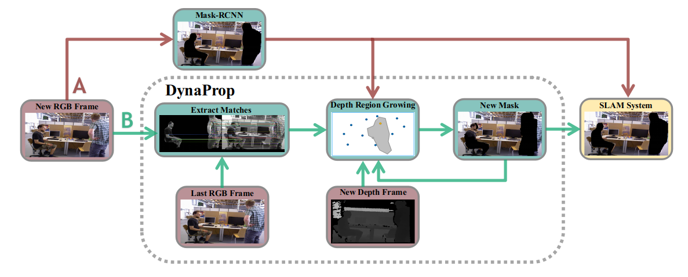

# DynaProp
DynaProp is an efficient RGB-D SLAM system for dynamic environments. A propagation based front-end is employed. Compared with deep learning based segmentation methods, it can significantly reduce the time consumption without the decrease of accuracy.



We provide examples to run the SLAM system in the [TUM dataset](http://vision.in.tum.de/data/datasets/rgbd-dataset/download). You can also run DynaProp in real time with ROS. We have tested the library in Ubuntu 20.04, but it should be easy to compile in other platforms.

## Getting Started
- Install ORB-SLAM2 prerequisites: C++11 or C++0x Compiler, Pangolin, OpenCV and Eigen3  (https://github.com/raulmur/ORB_SLAM2).
- Install boost libraries, python 2.7, keras and tensorflow, and download the `mask_rcnn_coco.h5` model  (https://github.com/BertaBescos/DynaSLAM).
- ROS (optional): If you are using ROS, we suggest you rebuild cv_bridge from this source with just a little modification (https://github.com/ros-perception/vision_opencv/tree/indigo/cv_bridge) to avoid version collision of OpenCV and cv_bridge.
- Clone this repo:
```bash
git clone https://github.com/yxianzhe/DynaProp.git
cd DynaProp
```
- Install pycocotools:
```bash
git clone https://github.com/waleedka/coco.git
cd coco/PythonAPI
make
sudo make install
mv coco/PythonAPI/pycocotools src/python
```
- Place the `mask_rcnn_coco.h5` model in the folder `DynaProp/src/python/`.
- Build DynaProp:
```bash
cd DynaProp
chmod +x build.sh
./build.sh
```

## RGB-D Example on TUM Dataset
- Download a sequence from http://vision.in.tum.de/data/datasets/rgbd-dataset/download and uncompress it.

- Associate RGB images and depth images executing the python script [associate.py](http://vision.in.tum.de/data/datasets/rgbd-dataset/tools):

  ```bash
  python associate.py PATH_TO_SEQUENCE/rgb.txt PATH_TO_SEQUENCE/depth.txt > associations.txt
  ```
These associations files are given in the folder `./Examples/RGB-D/associations/` for the TUM dynamic sequences.

- Execute the following command. Change `TUMX.yaml` to TUM1.yaml,TUM2.yaml or TUM3.yaml for freiburg1, freiburg2 and freiburg3 sequences respectively. Change `PATH_TO_SEQUENCE_FOLDER` to the uncompressed sequence folder. Change `ASSOCIATIONS_FILE` to the path to the corresponding associations file. `PATH_TO_MASKS` and `PATH_TO_OUTPUT` will save the masks and masked RGB images respectively.

  ```bash
  ./Examples/RGB-D/rgbd_tum Vocabulary/ORBvoc.txt Examples/RGB-D/TUMX.yaml PATH_TO_SEQUENCE_FOLDER ASSOCIATIONS_FILE (PATH_TO_MASKS) (PATH_TO_OUTPUT)
  ```
  
## ROS RGB-D Example on TUM Dataset
- Export the working space folder `./Examples/ROS/DynaProp_ROS` to the ROS_PACKAGE_PATH environment variable. Open .bashrc file and add at the end the following line. Replace PATH by the folder where you cloned DynaProp:
```bash
export ROS_PACKAGE_PATH=${ROS_PACKAGE_PATH}:PATH/DynaProp/Examples/ROS/DynaProp_ROS
```
- Build DynaProp_ROS:
```bash
chmod +x build_ros.sh
./build_ros.sh
```
- Execute the following command to run DynaProp on TUM dateset. Change `PATH_TO_BAG_FILE` to the path of the rosbag. Alter the frequency or remap the topic if needed.
```bash
roscore
```
```bash
rosrun DynaProp_ROS RGBD Vocabulary/ORBvoc.txt Examples/RGB-D/TUMX.yaml
```
```bash
rosbag play --pause PATH_TO_BAG_FILE -r 1.0 /camera/rgb/image_color:=/camera/rgb/image_raw /camera/depth/image:=/camera/depth_registered/image_raw
```

## ROS RGB-D Example on your own Device
You will need to create a settings file with the calibration of your camera. We provide an example to run DynaProp_ROS with Intel Realsense D435i:
```bash
roslaunch realsense2_camera rs_camera.launch
```
```bash
rosrun DynaProp_ROS RGBD Vocabulary/ORBvoc.txt Examples/RGB-D/realsense.yaml
```


## Citation

## Acknowledgements
Our code builds on [DynaSLAM](https://github.com/BertaBescos/DynaSLAM).

# DynaProp